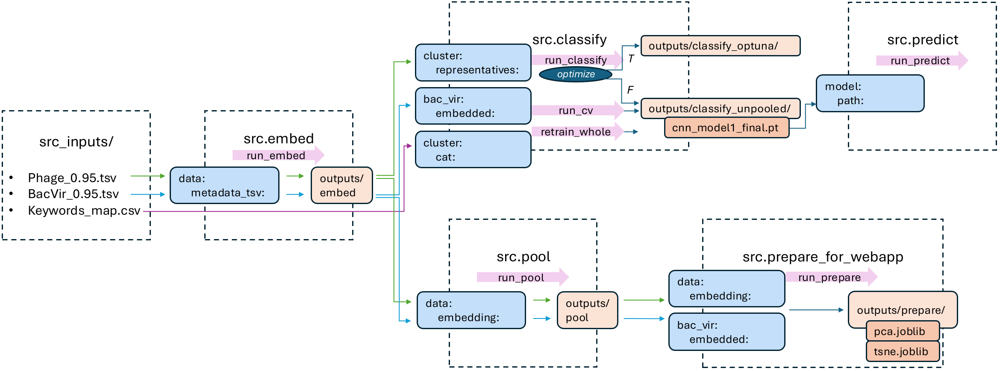

# PhageGAP-model

## Repository structure

- `src/` — Source code for the development, training, evaluation, and application of the PhageGAP model.
- `analysis/` — Downstream analysis of the trained model and its predictions, including scripts for generating the plots and tables presented in the publication.


### Model development
This project provides a modular pipeline for embedding protein sequences, processing embeddings, and classifying them into hierarchical functional categories using protein language models (pLMs).

To reproduce results, follow this workflow:



#### Predict protein functions for a new FASTA
To generate predictions for a new FASTA file, update the file paths in `src/predict/config.yaml` accordingly.

Navigate to `PhageGAP-model/`, then run:

```bash
python -m src.predict.run_predict
```

#### Overview

The pipeline consists of the following steps:

1. **Embedding** protein sequences using pretrained pLMs
2. **Pooling** embeddings (optional, depending on classifier)
3. **Classification** into hierarchical functional categories
4. **Retraining** on full dataset
5. **Prediction** for unknown proteins or custom FASTA input

#### Modules & Usage
Navigate to `PhageGAP-model/`

##### 1. Embedding: 
Generate embeddings for protein sequences using a selected pLM. \
Supported pLMs: ProtT5, ProstT5, ESM-C, ESM-2, ESM-3, gLM2 
```bash
python -m src.embed.run_embed
```

##### 2. Pooling: 
Pool per-residue embeddings over sequence length. \
Supported pooling strategies: mean and max pooling 
```bash
python -m src.pool.run_pool
```

##### 3. Classification:
Classify embeddings into functional categories. 
```bash
python -m src.classify.run_classify
```

* CNN: operates on unpooled embeddings
* MLP: operates on pooled embeddings

##### 4. Cross-validation:
Run CV to identify the best number of epochs. 
```bash
python -m src.classify.run_cv
```

##### 5. Retraining on full dataset:
Retrain the best model using all available labeled data. 
```bash
python -m src.classify.retrain_whole
```

##### 6. Prediction:
Predict functional categories for: 

* Unknown dataset entries
* Custom FASTA files (configurable)

```bash
python -m src.predict.run_predict
```

#### Training Procedure

1. **Data split**: Known labeled data is split into train, validation, and test data.
2. **Hyperparameter optimization**: Optuna study using 200 trials, reduced dataset size for speed, batch size of 128, and the objective to maximize the F1 score.
3. **Full training**: Using best hyperparameters train on full train/val/test split. Tracks per-epoch metrics.
4. **Model selection**: Checkpoint achieving the highest validation F1 score is selected.
5. **Evaluation**: Test F1 score is computed and confusion matrix generated.
6. **Run CV**: Run cross-validation to identify the best number of epochs.
6. **Retrain model**: Retrain model using all labeled data (train + val + test), configure number of epochs based on best-performing number of epochs (cf. CV).

#### Prediction on unknown data
Final retrained model is used to predict previously unknown proteins. \
Predictions can optionally be filtered using a probability threshold.

#### Configuration 
Each module uses its own configuration file.